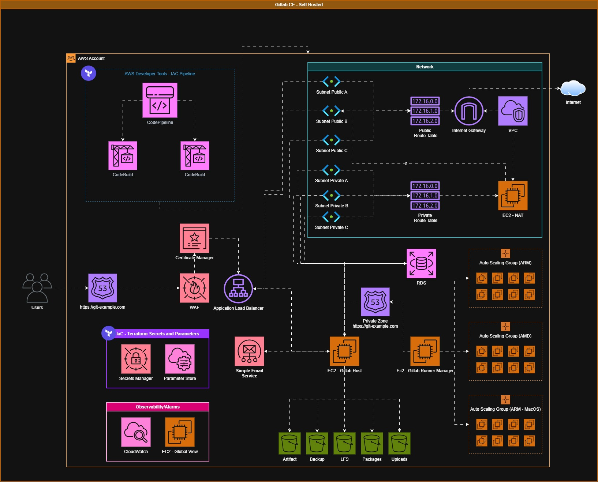
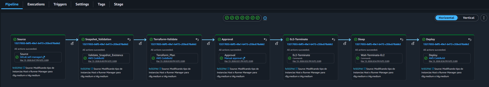

# GitLab Self-Hosted on AWS with Terraform

This repository contains Terraform modules and templates to provision a production-ready GitLab Self-Hosted environment on AWS. It serves as a reference architecture covering everything from base networking to automated runner scaling.

### Project Stack
* **Core Infra:** Modules for VPC, Subnets, EC2, EBS, RDS, and IAM.
* **Provisioning:** `user_data` templates and runner configurations located in `templates_tpl/`.
* **CI/CD:** Example `buildspec` for AWS CodePipeline/CodeBuild to automate deployments.
* **Observability & DNS:** Native integration with CloudWatch and Route53.

## Overview architecture


## CodePipeline Suggested Pipeline

---

### Recommended Deployment Workflow

To avoid circular dependencies with GitLab tokens, do **not** run a global `terraform apply` on the first pass. Follow this staged approach:

1.  **Backend:** Configure your S3 bucket and DynamoDB table for state locking.
2.  **Variables:** Update `terraform.tfvars` with your Account IDs, Region, and Domain.
3.  **Phase 1 (Base):** Provision the core infrastructure (VPC, Security Groups, RDS, LoadBalancer, Route53 and the GitLab Host instance).
4.  **GitLab Setup:** Once the instance boots, complete the initial setup in the GitLab UI and generate your **Runner Registration Tokens**.
5.  **Phase 2 (Runners):** Store the tokens in AWS Secrets Manager, then enable the Runner Manager / Autoscaling modules.

> **Note:** The GitLab instance must be online to generate the tokens required for runner registration. Attempting to deploy everything at once will result in registration failures.

---

### State & Secrets Management

#### Remote Backend
The `providers.tf` file includes a commented S3 backend example. For shared environments, **always** use encryption and locking:

```hcl
terraform {
  backend "s3" {
    bucket         = "your-terraform-state-bucket"
    key            = "gitlab/terraform.tfstate"
    region         = "us-east-1"
    encrypt        = true
    dynamodb_table = "terraform-lock"
  }
}
```

### How to run the project

1.  **Initialize Terraform:**
    ```bash
    terraform init
    ```
2.  **Plan the deployment:**
    ```bash
    terraform plan
    ```
3.  **Apply the changes:**
    ```bash
    terraform apply
    ```

### Sensitive Data Handling
Never commit secrets to version control. This project is structured to pull sensitive values (DB passwords, tokens, SES keys) via AWS Secrets Manager or local files ignored by Git.

locals.tf expects files like root.json or ses.json. Ensure your CI pipeline injects these files or that they exist locally only during testing.

### Operation & Security Notes
User Data: The script in templates_tpl/user_data.tpl handles the GitLab bootstrap. Before scaling, validate the Instance IAM Role (least privilege) and ensure the script matches your AMI architecture (x86 vs. Arm64).

Hardening: Restrict SSH access via Security Groups, enable detailed CloudWatch logging, and review S3/RDS backup lifecycle policies.

Runners: Runners use auto-scaling. Review the instance types in the autoscaling module to optimize for your specific workload costs.

### Diagrams
./images/architecture.jpg - High-level architecture of the GitLab Self-Hosted environment on AWS.
./images/codepipeline.png - Suggested AWS CodePipeline structure for CI/CD automation.

### License
This project is licensed under the [MIT License](./LICENSE).